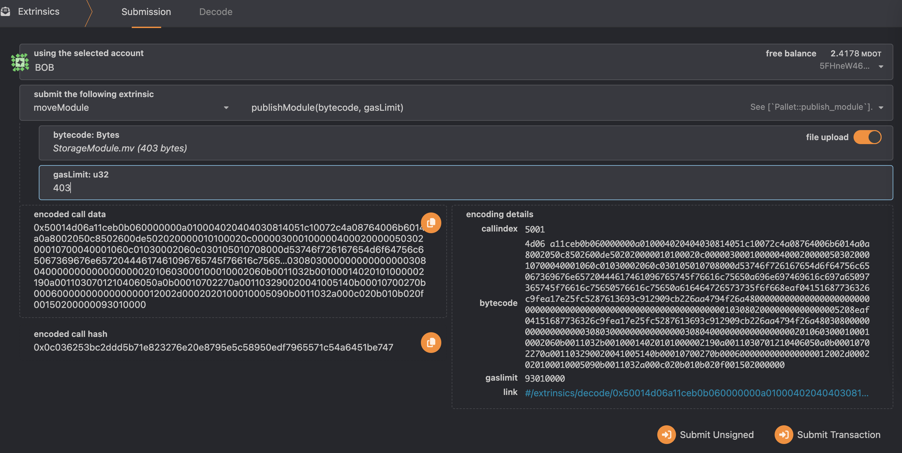

# Move-Smart-Contract-Test


## setup

Prerequisites: 
- [Install smove](https://github.com/eigerco/smove).
- Setup parachain node with pallet-move integrated and run it in the background.
- Switch the current working directory to the code example.

## build

Now, let's compile this project to be ready for the estimation of needed gas and publication of the module.
```sh
smove build
```

## Publishing Modules

### Estimating Gas for Module Publication

Gas can be seen as weights in the Substrate. It will adjust the fees for the execution or publication of Move resources. Hereby, we prevent malicious scripts from running forever.

To estimate the optimal amount of gas for your module, use `smove` tool:
```sh
smove node rpc estimate-gas-publish-module --account-id 5FHneW46xGXgs5mUiveU4sbTyGBzmstUspZC92UhjJM694ty --module-path build/storage_project/bytecode_modules/StorageModule.mv
```

The successful result will look like:
```sh
Gas estimation:
    used gas: 403
    total extrinsic weight cost with the above gas:
    	Weight { ref_time: 8377058325, proof_size: 13927 }
    vm_status_code: EXECUTED
```

### Publication

The compiled bytecode file can be found in the subfolder
```sh
build/storage_project/bytecode_modules/
```

Do the following steps in [polkadot.js][polkadotjs] GUI:
* Switch to menu _Developer_->_Extrinsics_.
* Select the Move pallet `moveModule`.
* For this pallet, choose extrinsic `publishModule(bytecode, gasLimit)` and select `Bob` as the user who shall submit the transaction.

Parameter explanation:
  - __bytecode__ represents the compiled module bytecode. Fill it up by uploading the compiled file `StorageModule.mv` (from the previous compilation).
  - __gasLimit__ - use the estimated optimal amount of gas for publishing this module from the previous subsection. Using less than that will make the extrinsic fail, while using more is unnecessary (and more costly).

|  |
|:--:|
| _Publish a module using [polkadot.js][polkadotjs]_ |

Note that the module can only be published if the specified module address `DeveloperBob` in the `Move.toml` file of the Move project matches the user's address (in this case, Bob's wallet address).

Additionally, we can verify that the module has successfully been published by requesting the module's ABI specification using `smove`:
```sh
smove node rpc get-module-abi --address 5FHneW46xGXgs5mUiveU4sbTyGBzmstUspZC92UhjJM694ty --name StorageModule
```
You should get a longer response that starts with:
```sh
Module ABI: Some(ModuleAbi { id: ModuleId { address: 8eaf04151687736326c9fea17e25fc5287613693c912909cb226aa4794f26a48, name: Identifier("StorageModule") }, friends: [], structs: [Struct { name: Identifier("Data"), type_parameters: [], abilities: TypeAbilities { abilities: [Store, Key] }, fields: [Field { name: Identifier("value"), tp: U64 }] }], funcs: [Function { name: Identifier("get_value"), visibility: Public, type_parameters: [], parameters: [Reference(Signer)], returns: [U64] }, Function { name: Identifier("initialize"), visibility: Public, type_parameters: [], parameters: [Reference(Signer)], returns: [] }, Function { name: Identifier("set_value"), visibility: Public, type_parameters: [], parameters: [Reference(Signer), U64], returns: [] }] })
```
That is the proof that the module has been published on the chain successfully.
